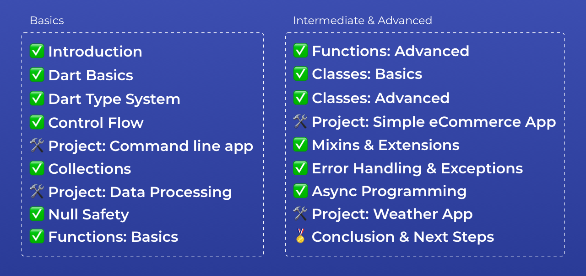
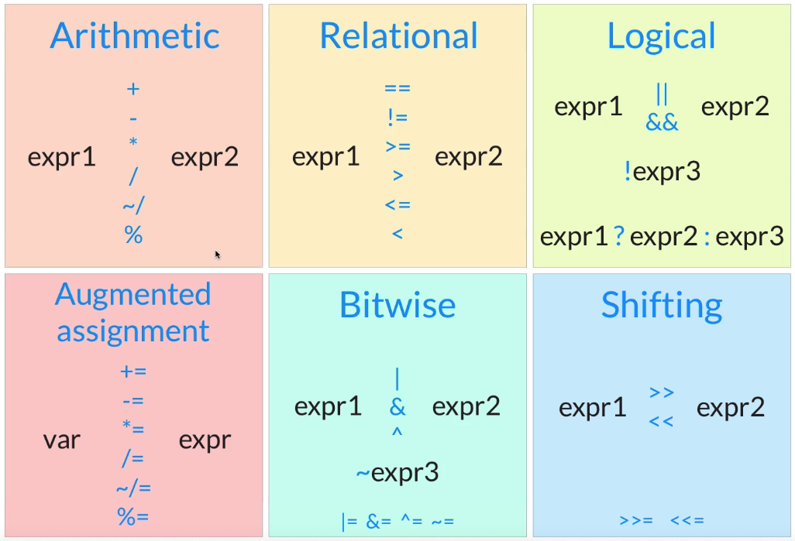
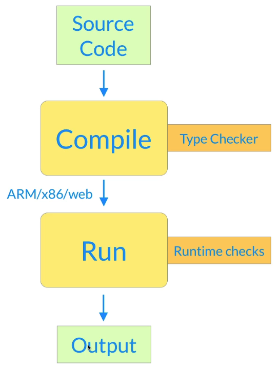
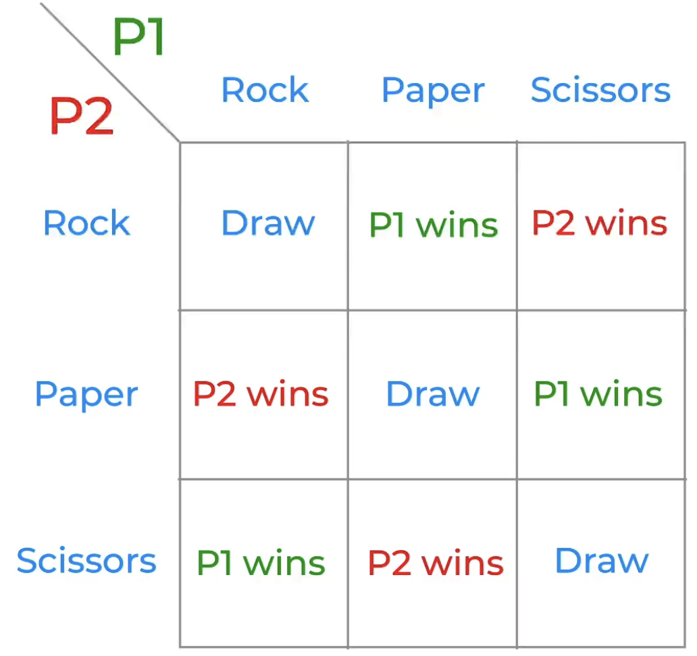

# hi-dart



> 仅记与JS区别部分！

## lesson 12 String interpolation

```dart
void main() {
  String name = "jerry";
  int age = 18;
  double height = 1.80;
  bool likesDart = true;

  print("My name is $name. I'm $age years old. I'm $height meters tall.");

  print("plus = ${age + height}");
}
```

## lesson 13 String Escaping

```dart
void main() {
  int a = 10;
  print("$a");	// -> 10
  print("\$a");	// -> $a
  print("\$$a");// -> $10
}
```

## lesson 14 Multi-line strings

> 直接连着单引号或者三个双引号!

```dart
void main() {
  print('This is a short sentence.\n'
       'This is a longer sentence, I dare say.\n'
       'This is even longer sentence, which will not fit inside a single line.'
  );
}
```

```dart
void main() {
  String s = """
This is a short sentence.
This is a longer sentence, I dare say.
This is even longer sentence, which will not fit inside a single line.
""";

  print(s);
}
```

> 语法糖竟然那么甜！

## lesson 18 Finding and replacing strings

```dart
void main() {
  String title = "I love pizza";
  bool containsPazza = title.contains('pizza');
  print(containsPazza);
  String lovePasta = title.replaceAll('pizza', 'pasta');
  print(lovePasta);
}
```

### lesson 19 Conversations between types

- 不要企图转换非法类型的值，否则一样抛异常！

```dart
void main() {
  String ratingString = '4.5';
  double tating = double.parse(ratingString);
  print(tating);

  String helloString = 'hello';
  print(double.parse(helloString));
}
```

## lesson 20 Arithmetic operators



## lesson 21 Exercise: temperature conversion

```dart
void main() {
  double tempFarenheit = 88.88;
  double tempCelsius = (tempFarenheit - 32) / 1.8;

  print('${tempFarenheit}°F = ${tempCelsius.toStringAsFixed(2)}°C');
}
```

## lesson 23 Logical & Relational operators

```dart
void main() {
  print(5 == 2);
  print(5 != 2);
  print(5 >= 2);
  print(5 > 2);
  print(5 <= 2);
  print(5 < 2);

  print(5 < 2.5);   // -> false
  print(5 < 'hi');  // -> ❌ Error: Compilation failed.
}
```

## lesson 25 Hex format, bitwise & shifting operators

```dart
void main() {
  int x = 0xF0; // binary: 111000
  int y = 0x0F; // binary: 000111

  print((x | y).toRadixString(2));    // -> 11111111
  print((x | y).toRadixString(16));   // -> ff
  print((x ^ y).toRadixString(2));   // -> 0
    print((~y).toRadixString(2));
}
```

## lesson 28 Dart Type System

- Static vs dynamic languages
- Type Infernce
- `var`, `final`, `const`, `dynamic` keywords

## leeson 29 Compile



Static languages: advantages

- Discover type-related bugs at compile time
  - Huge time saver => hard to discover runtime bugs in big projects
- More readable code
  - Rely on variables having the type they were declared with
- More maintainable code
  - When you change someting, type system warns you about things that break
- Compiled code is more effieient
  - compiler knows more and can optimise things

## lesson 31

- final means `read-only` (can only be set once);
- perfer `final` to `var` whenever possible
- 对，尽可能地使用 `final` 而不是用 `var`

```dart
void main() {
  var name = 'Jerry';
  var age = 30;
  var height = 1.88;

  final newAge = 31;
  newAge = 32; // line 7 • The final variable 'newAge' can only be set once.
}
```

## lesson 32 const

- const defines a `compile-time constant`
- very good for performance => Dart can optimize generated code
- const 的变量只能被赋值常量，为什么字符串转换也不行！
- 说是 `title.toUpperCase()` 只能在 `runtime` 被执行，在编译时无法确定！
- `var` 倒是随便被赋值多少次都可以！
- `final` 只能被赋值一次
- `const` 只能被赋值编译时的常量 -> `compile-time constants`

> **Best Practice**
>
> **const > final > var**

```dart
void main() {
  const title = "Dart 123";
  const titleUppercaed = title.toUpperCase(); // ❌
  // Const variables must be initialized with a constant value.
  print(titleUppercaed);
}
```

## lesson 33 Exercise: var, final and const

Given the following program:

```dart
void main() {
  String text = 'I like pizza';
  String topping = 'with tomatoes';
  String favourite = '$text $topping';
  String newText = favourite.replaceAll('pizza', 'pasta');
  favourite = 'Now I like curry';
  print(newText);
}
```

Can you guess which variables can be declared as `const`, `final`, and `var`, while still resulting in a valid program?

Remember: prefer `const` over `final` over `var`.

```dart
void main() {
  const text = 'I like pizza';
  const topping = 'with tomatoes';
  String favourite = '$text $topping';
  final newText = favourite.replaceAll('pizza', 'pasta');
  favourite = 'Now I like curry';
  print(newText);
}
```

## lesson 34 The 'dynamic' keyword

- use dynamic to `opt-out` of type safety
- 使用 dynamic 去过类型安全检查？
- `var` 的变量可以多次赋值相同类型的值，但不能跨类型赋值

```dart
void main() {
  var x = 10;
  x = true; // -> ❌  A value of type 'bool' can't be assigned to a variable of type 'int'.

  dynamic y = 10;
  y = true;
}
```

- 🔥 `dynamic` is useful in very specific cases
- for erverthing else, use `var`, `final`, `const`

> 终于乱清楚了 Dart 里的 `var`, `final`, `const`

## lesson 41 'break' and 'continue'

- `for` 循环用 `var` 挺好
- `for (var i = 1; i<=15; i++)`
- Use `break` and `continue` to alter the flow inside `for/while` loops
- Not always necessary (can implement fizz buzz with if/else only)
- Use them as needed

## lesson 43 enumerations

- 用起来很轻松

```dart
enum Medal { gold, silver, bronze }
```

## lesson 44 Exercise: simple calculator

```dart
enum Operation { plus, minus, multiply, divide }

void main() {
  const a = 4;
  const b = 2;
  const op = Operation.plus;

  switch (op) {
    case Operation.plus:
      print('$a + $b = ${a + b}');
      break;
    case Operation.minus:
      print('$a - $b = ${a - b}');
      break;
    case Operation.multiply:
      print('$a + $b = ${a * b}');
      break;
    case Operation.divide:
      print('$a - $b = ${a / b}');
      break;
    default:
      break;
  }
}
```

## Dart Initial

- `https://dart.dev/tools/sdk/archive`
- 解压安装包后将 `bin` 目录固定好
- 修改终端配置，添加环境变量
  - `export PATH=/Users/szy0syz/workspace/dart/dart-sdk/bin:$PATH`
- VSCode plugins
  - `dart`
  - dracula official
  - Bracket Pari Colorizer 2
  - Error Lens

## Project: Rock, Paper & Scissors



```dart
enum Move { rock, paper, scissors }
// index: 0,1,2,3...

void main() {
  final rng = Random();
  while (true) {
    stdout.write("Rock, paper or scissors? (r/p/s)");
    final input = stdin.readLineSync();
    if (input == 'r' || input == 'p' || input == 's') {
      // playerMove is declared without an initializer (defaults to null)
      var playerMove;
      if (input == 'r') {
        playerMove = Move.rock;
      } else if (input == 'p') {
        playerMove = Move.paper;
      } else {
        playerMove = Move.scissors;
      }
      final random = rng.nextInt(3);
      final aiMove = Move.values[random];

      print('You played: $playerMove');
      print('AI played: $aiMove');

      // --- 判断比赛结果 ---
      if (playerMove == aiMove) {
        print("It's a draw");
      } else if (playerMove == Move.rock && aiMove == Move.scissors ||
          playerMove == Move.paper && aiMove == Move.rock ||
          playerMove == Move.scissors && aiMove == Move.paper) {
        print("You win");
      } else {
        print("You lose");
      }
    } else if (input == 'q') {
      break;
    } else {
      print("Invalid input");
    }
  }
}
```

> l-54
