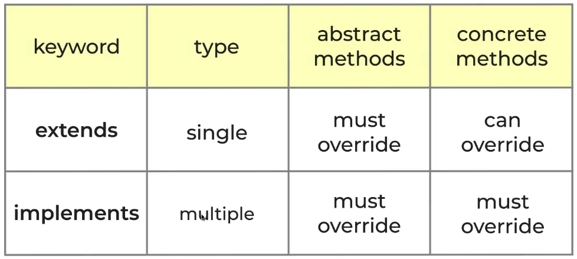
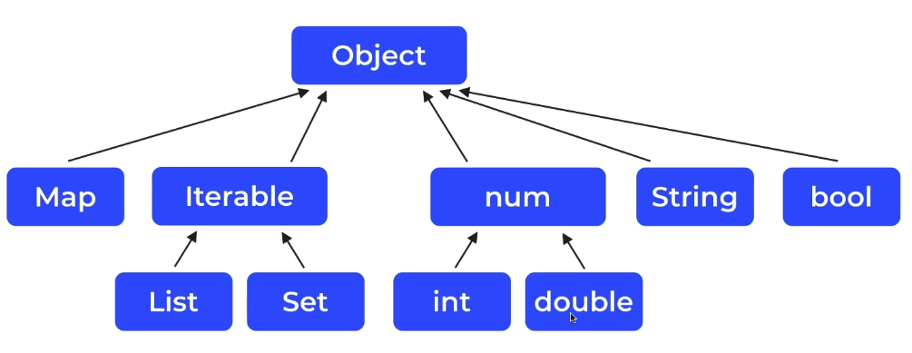
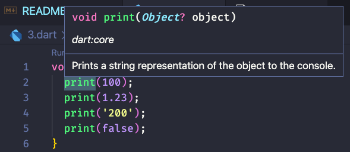
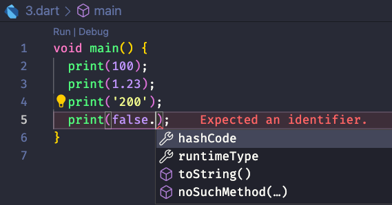
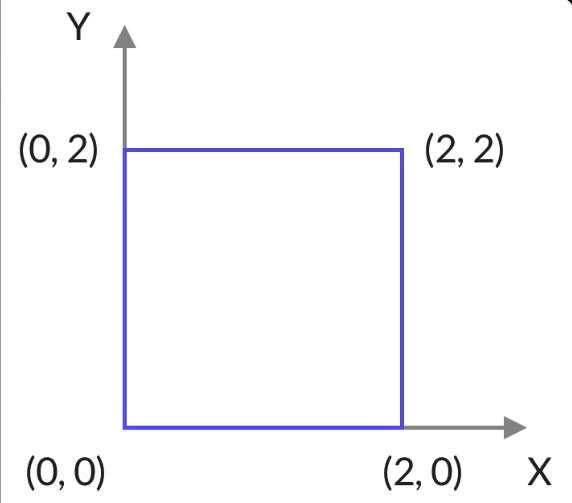
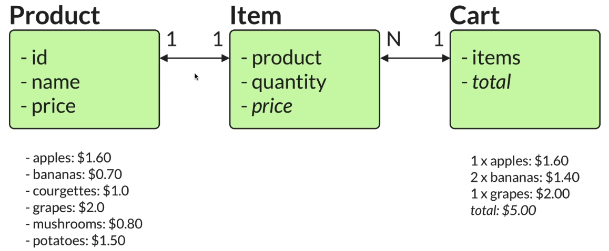

# hi-dart


## lesson 12 String interpolation

```dart
void main() {
  String name = "jerry";
  int age = 18;
  double height = 1.80;
  bool likesDart = true;

  print("My name is $name. I'm $age years old. I'm $height meters tall.");

  print("plus = ${age + height}");
}
```

## lesson 13 String Escaping

```dart
void main() {
  int a = 10;
  print("$a"); // -> 10
  print("\$a"); // -> $a
  print("\$$a"); // -> $10
}
```

## lesson 14 Multi-line strings

> 直接连着单引号或者三个双引号!

```dart
void main() {
  print('This is a short sentence.\n'
       'This is a longer sentence, I dare say.\n'
       'This is even longer sentence, which will not fit inside a single line.'
  );
}
```

```dart
void main() {
  String s = """
This is a short sentence.
This is a longer sentence, I dare say.
This is even longer sentence, which will not fit inside a single line.
""";

  print(s);
}
```

> 语法糖竟然那么甜！

## lesson 18 Finding and replacing strings

```dart
void main() {
  String title = "I love pizza";
  bool containsPazza = title.contains('pizza');
  print(containsPazza);
  String lovePasta = title.replaceAll('pizza', 'pasta');
  print(lovePasta);
}
```

### lesson 19 Conversations between types

- 不要企图转换非法类型的值，否则一样抛异常！

```dart
void main() {
  String ratingString = '4.5';
  double tating = double.parse(ratingString);
  print(tating);

  String helloString = 'hello';
  print(double.parse(helloString));
}
```

## lesson 20 Arithmetic operators


## lesson 21 Exercise: temperature conversion

```dart
void main() {
  double tempFarenheit = 88.88;
  double tempCelsius = (tempFarenheit - 32) / 1.8;

  print('${tempFarenheit}°F = ${tempCelsius.toStringAsFixed(2)}°C');
}
```

## lesson 23 Logical & Relational operators

```dart
void main() {
  print(5 == 2);
  print(5 != 2);
  print(5 >= 2);
  print(5 > 2);
  print(5 <= 2);
  print(5 < 2);

  print(5 < 2.5);   // -> false
  print(5 < 'hi');  // -> ❌ Error: Compilation failed.
}
```

## lesson 25 Hex format, bitwise & shifting operators

```dart
void main() {
  int x = 0xF0; // binary: 111000
  int y = 0x0F; // binary: 000111

  print((x | y).toRadixString(2));    // -> 11111111
  print((x | y).toRadixString(16));   // -> ff
  print((x ^ y).toRadixString(2));   // -> 0
    print((~y).toRadixString(2));
}
```

## lesson 28 Dart Type System

- Static vs dynamic languages
- Type Infernce
- `var`, `final`, `const`, `dynamic` keywords

## leeson 29 Compile


Static languages: advantages

- Discover type-related bugs at compile time
  - Huge time saver => hard to discover runtime bugs in big projects
- More readable code
  - Rely on variables having the type they were declared with
- More maintainable code
  - When you change someting, type system warns you about things that break
- Compiled code is more effieient
  - compiler knows more and can optimise things

## lesson 31

- final means `read-only` (can only be set once);
- perfer `final` to `var` whenever possible
- 对，尽可能地使用 `final` 而不是用 `var`

```dart
void main() {
  var name = 'Jerry';
  var age = 30;
  var height = 1.88;

  final newAge = 31;
  newAge = 32; // line 7 • The final variable 'newAge' can only be set once.
}
```

## lesson 32 const

- const defines a `compile-time constant`
- very good for performance => Dart can optimize generated code
- const 的变量只能被赋值常量，为什么字符串转换也不行！
- 说是 `title.toUpperCase()` 只能在 `runtime` 被执行，在编译时无法确定！
- `var` 倒是随便被赋值多少次都可以！
- `final` 只能被赋值一次
- `const` 只能被赋值编译时的常量 -> `compile-time constants`

> **Best Practice**
>
> **const > final > var**

```dart
void main() {
  const title = "Dart 123";
  const titleUppercaed = title.toUpperCase(); // ❌
  // Const variables must be initialized with a constant value.
  print(titleUppercaed);
}
```

## lesson 33 Exercise: var, final and const

Given the following program:

```dart
void main() {
  String text = 'I like pizza';
  String topping = 'with tomatoes';
  String favourite = '$text $topping';
  String newText = favourite.replaceAll('pizza', 'pasta');
  favourite = 'Now I like curry';
  print(newText);
}
```

Can you guess which variables can be declared as `const`, `final`, and `var`, while still resulting in a valid program?

Remember: prefer `const` over `final` over `var`.

```dart
void main() {
  const text = 'I like pizza';
  const topping = 'with tomatoes';
  String favourite = '$text $topping';
  final newText = favourite.replaceAll('pizza', 'pasta');
  favourite = 'Now I like curry';
  print(newText);
}
```

## lesson 34 The 'dynamic' keyword

- use dynamic to `opt-out` of type safety
- 使用 dynamic 去过类型安全检查？
- `var` 的变量可以多次赋值相同类型的值，但不能跨类型赋值

```dart
void main() {
  var x = 10;
  x = true; // -> ❌  A value of type 'bool' can't be assigned to a variable of type 'int'.

  dynamic y = 10;
  y = true;
}
```

- 🔥 `dynamic` is useful in very specific cases
- for erverthing else, use `var`, `final`, `const`

> 终于乱清楚了 Dart 里的 `var`, `final`, `const`

## lesson 41 'break' and 'continue'

- `for` 循环用 `var` 挺好
- `for (var i = 1; i<=15; i++)`
- Use `break` and `continue` to alter the flow inside `for/while` loops
- Not always necessary (can implement fizz buzz with if/else only)
- Use them as needed

## lesson 43 enumerations

- 用起来很轻松

```dart
enum Medal { gold, silver, bronze }
```

## lesson 44 Exercise: simple calculator

```dart
enum Operation { plus, minus, multiply, divide }

void main() {
  const a = 4;
  const b = 2;
  const op = Operation.plus;

  switch (op) {
    case Operation.plus:
      print('$a + $b = ${a + b}');
      break;
    case Operation.minus:
      print('$a - $b = ${a - b}');
      break;
    case Operation.multiply:
      print('$a + $b = ${a * b}');
      break;
    case Operation.divide:
      print('$a - $b = ${a / b}');
      break;
    default:
      break;
  }
}
```

## Dart Initial

- `https://dart.dev/tools/sdk/archive`
- 解压安装包后将 `bin` 目录固定好
- 修改终端配置，添加环境变量
  - `export PATH=/Users/szy0syz/workspace/dart/dart-sdk/bin:$PATH`
- VSCode plugins
  - `dart`
  - dracula official
  - Bracket Pari Colorizer 2
  - Error Lens

## Project: Rock, Paper & Scissors


```dart
enum Move { rock, paper, scissors }
// index: 0,1,2,3...

void main() {
  final rng = Random();
  while (true) {
    stdout.write("Rock, paper or scissors? (r/p/s)");
    final input = stdin.readLineSync();
    if (input == 'r' || input == 'p' || input == 's') {
      // playerMove is declared without an initializer (defaults to null)
      var playerMove;
      if (input == 'r') {
        playerMove = Move.rock;
      } else if (input == 'p') {
        playerMove = Move.paper;
      } else {
        playerMove = Move.scissors;
      }
      final random = rng.nextInt(3);
      final aiMove = Move.values[random];

      print('You played: $playerMove');
      print('AI played: $aiMove');

      // --- 判断比赛结果 ---
      if (playerMove == aiMove) {
        print("It's a draw");
      } else if (playerMove == Move.rock && aiMove == Move.scissors ||
          playerMove == Move.paper && aiMove == Move.rock ||
          playerMove == Move.scissors && aiMove == Move.paper) {
        print("You win");
      } else {
        print("You lose");
      }
    } else if (input == 'q') {
      break;
    } else {
      print("Invalid input");
    }
  }
}
```

## Collections

> A collection is a group of values that belong together

- Lists, sets, maps
- How to use them, common operations
- Type system & type inference with collections
- Collection-if, collection-for, spreads

- Dart 中 List 照样不能越界
- `[].first` -> ❌
- final variabs cant be `re-assigned`
- but you can still modify `their contents`

Warp Up

- you can declare list variables as var, final, const
- final, const variables can only be `set once`
- can still `modify` contents of final variables
- but not with const variables
- Sets are collections of `unique` values
- List can contain `deplicate` values

Sets

```dart
var euCountries = {'Italy', "UK", "Russia"};
var asianCountries = {'Inida', 'China'};
euCountries.add("UK");
print(euCountries); // -> {Italy, UK, Russia}
print(euCountries.union(asianCountries));
// -> {Italy, UK, Russia, Inida, China}
print(euCountries.intersection(asianCountries)); // -> {}
print(euCountries.difference(asianCountries));
// -> {Italy, UK, Russia}
```

Map

> JSON

```dart
Map<String, dynamic> person = {'name': "Jerry", 'age': 18, 'height': 180};

var person2 = <String, dynamic>{
  'name': "Jerry2",
  'age': 18,
};

var name = person["name"];
print(name);

person["likesPizza"] = true;
print(person);

// 要是想确定它的类型，好打点的话
var name = person['name'] as String;
```

- 和 JS 一样的，类似于 Object，还能增加额外属性嘛
- 如果你用 `dynamic` 确定 map 的属性值的类型，那么可以用 `as` 操作符

- 注意 `Map` 上没有迭代器，所以不能使用 `// for (var item in person) {}` 迭代 ❌
- 但可以像 js 那个获取 keys ，通过 keys 来遍历
- 竟然也有 `Map.values` 和 js 的 object 很像

```dart
for (var key in person.keys) {
  print(key);
  print(person[key]);
}

for (var value in person.values) {
  print(value);
}

for (var entry in person.entries) {
  print('${entry.key}: ${entry.value}');
}
```

## lesson 66 Exercise: Pizza Ordering

```dart
void main() {
  const pizzPrices = {'margherita': 5.5, 'pepperoni': 7.5, 'vegetarian': 6.5};
  const order = ['margherita', 'pepperoni', 'hot'];
  var total = 0.0;

  for (var item in order) {
    final price = pizzPrices[item];
    if (price != null) {
      total += price;
    } else {
      print('$item pizza is not on the menu');
    }
  }

  print('Total: \$$total');

  /*
  hot pizza is not on the menu
  Total: $13.0
  */
}
```

## lesson 68 Exercise: Restaurant ratings

```dart
void main() {
  var restaurants = [
    {
      'name': 'Pizza Mario',
      'cuisine': 'Italian',
      'ratings': [5.0, 3.5, 4.5],
    },
    {
      'name': 'Chez Anne',
      'cuisine': 'French',
      'ratings': [5.0, 4.5, 4.0],
    },
    {
      'name': 'Navaratna',
      'cuisine': 'Italian',
      'ratings': [4.0, 4.5, 4.0],
    },
  ];

  for (var restaurant in restaurants) {
    final ratings = restaurant['ratings'] as List<double>;
    var total = 0.0;
    for (var rating in ratings) {
      total += rating;
    }
    final avgRating = total / ratings.length;
    restaurant['avgRating'] = avgRating.toStringAsFixed(2);
    print(restaurant);
  }
}
```

## lesson 69 Collection-if

> 竟然可以在声明集合时用 if

```dart
void main() {
  const addBlue = false;
  const addRed = true;
  const extraColors = ['yellow', 'green'];
  final colors = [
    'grey',
    'brown',
    if (addBlue) 'blue',
    if (addRed) 'red',
  ];
  colors.addAll(extraColors);
  print(colors);
}
```

## lesson 70 Collection-for

```dart
const extraColors = ['yellow', 'green'];
final colors = [
  'grey',
  'brown',
  if (addBlue) 'blue',
  for (var color in extraColors) color,
];
```

## lesson 71 Spreads

```dart
final colors = [
  'grey',
  'brown',
  if (addBlue) 'blue',
  ...extraColors,
];
```

- 到底该怎么用 `Collection-if` / `Collection-for`
- 目前场景就是在一个根据条件生成的新 Map 时，是直接字面量生成法

```dart
const grans = {
  'rice': '1kg'
}

var shoppingList = {
  if (bann > 0) 'bann': 123,
  if (apples > 0) 'apples': 'ok',
  if (addGrains) ...grans
}
```

### lesson 73 Copying collections

> 和 js 一样的，用 `Spreads` `...`
>
> 当然还是有 shallow vs deep copy
>
> collections 不能少了 `filter` `map` `reduce`

## Project: Data Processing

- 要点：`Code Defensively` -> `Fail Gracefully`
- 防御性编程 -> 优雅的处理异常
- Top Tip: Choose `descriptive` names for variables, as the carry more `meaning`
- 给变量取一个有描述意义的名称，这样它讲带来更多意义，使人读起来好理解

```dart
void main(List<String> args) {
  if (args.isEmpty) {
    print('Usage: dart totals.dart <inputFile.csv>');
    exit(1);
  }

  final inputFile = args.first;
  // 要注意FS异常，一般这么做：
  // 先检查文件是否存在，再去读它。
  final lines = File(inputFile).readAsLinesSync();
  final totalDurationByTag = <String, double>{};

  // 不要表头
  lines.removeAt(0);

  var totalDutation = 0.0;
  for (var line in lines) {
    final values = line.split(',');
    final durationStr = values[3].replaceAll('"', '');
    final duration = double.parse(durationStr);
    final tag = values[5].replaceAll('"', '');
    final previousTotal = totalDurationByTag[tag];

    if (previousTotal == null) {
      totalDurationByTag[tag] = duration;
    } else {
      totalDurationByTag[tag] = previousTotal + duration;
    }

    totalDutation += duration;
  }

  for (var entry in totalDurationByTag.entries) {
    final durationFormatted = entry.value.toStringAsFixed(1);
    final tag = entry.key == '' ? 'Unallocated' : entry.key;
    print('$tag: ${durationFormatted}h');
  }

  print('\nTotalDutation: ${totalDutation.toStringAsFixed(1)}h');
}
```

## Null Safty

> nullable & non-nullable types
>
> Null Safty 竟然就是 ? ! ?? 操作符 🥶

```dart
void main(List<String> args) {
  int a = 1;
  int? b;

  print(a + b);  -> ❌
  // The argument type 'int?' can't be assigned to the parameter type 'num'.
}
```

- Flow Analysis: Promotion
- Nullable variables can be promoted to non-nullable
- 我们可以在流程上提前处理 null 的情况

- Flow Analysis: Definite Assignment
- Dart knows for sure when a varible is assigned

```dart
if (b == null) {
  print('a is null');
} else {
  print(a + b);
}
```

- Dart without Null Safety -> Runtime error
- Dart with Null Safety -> Compile-time error
- -> the compiler helps us to write safer programs
- 这难道就是 `Null Safty` 的奥义把！
- `Null Safty` makes us more `productive`
  - great advantage on bigger programs
  - 当然可以在大型项目中带来巨大的优势
- Dart can tell us when we're doing something wrong

## leeson 82 The assertion operator

- 断言操作符 (!)
- 不摆了，就是和 ts 差不多的
- if you are sure that a nullable variable will always have a non-nullable value,
- it is safe to assign it to a non-nullable variable with the `!` operator.
- but if you are wrong, you will get a runtime error
- `!` is also called the `bang` operator 💥
- 传说中的 💣 `炸弹操作符`，真逗！

## lesson 83 The if-null operator

- `int? maybeValue;`
- `int value = maybeValue == null ? 0 : maybeValue;`
- -> `int value = maybeValue == null ?? 0;`
- -> `maybeValue ??= 0;`

## lesson 84 Null Safety with type inference

```dart
void main() {
  const x = -1;
  var maybeValue;
  if (x > 0) {
    maybeValue = x;
  }
  maybeValue ??= 0;
  final value = maybeValue;
  print(value);
}
```

- Should we use type inference or decalare types explicity?
- 我们到底应该使用类型声明还是多用类型推断？
- initialize variables when you declare them,
- and use type inference
- 建议我们在定义和初始化变量时，可以使用类型推断
- Type inference and Null Safty work well with each other
- 应该使用类型推断和 Null Safty 组合起来用更好

## lesson 85 Null Safety with collections

```dart
void main() {
  // 在 runtime，很容易出现下面这样情况，此时如果调用null上的一些字符串方法就崩了
  // const cities = <String>['London', 'Paris', null];

  const cities = <String?>['London', 'Paris', null];

  for (var city in cities) {
    print(city?.toUpperCase());
  }
}
```

- Calling methods on null variables is a very common mistake -> 赞同 👍
- Null Pointer exception 空指针异常

## lesson 86 The conditional access operator & the billion dollar mistake

Null Safety features:

- Nullable & non-nullable varibles
- Flow Analysis: promotion & definite assignemnt
- 提升 null 变量的处理 和 变量定义时就强制确认非空类型
- Every time you declare a variable, think about whether it should be nullable or not
- 每次定义变量时，提前想好这家伙到底能不能为 `nullable`
- This will lead to better code

## Functions

> Essential build blocks to organize our code and make it more reusable

- How to declare and use functions (pass arguments, get return value)
- Difference between named and positional arugments
- Default Values and required arguments+ how to use them with Null Safety
- Arrow notation to write more concise functions
- Lexical scope & inner functions
- Avoiding global mutable state & pure functions

```dart
void main() {
  print(sum([1,2,3,4]));
}

double sum(List<double> values) {
  var sum = 0.0;
  for (var value in values) {
    sum += value;
  }
  return sum;
}
```

## lesson 94 Default positional arguments

```dart
void main() {
  foo(1, 5);
}

void foo(int a, [int b = 2]) {
  print('a: $a, b: $b');
}
```

## lesson 103 Function Types

> 函数签名

```dart
// typedef Greet = String Function(String);
typedef String Greet(String name);

void main() {
  final sayHi = (name) => 'Hi, $name.';

  welcome(sayHi, 'Jerry');
}

void welcome(Greet greet, String name) {
  print(greet(name));
  print('Welcome to this');
}
```

## lesson 104 Closures

```dart
void main() {
  const mul = 10;
  const list = [1, 2, 3];
  final result = list.map((x) => x * mul);
  print(result);
}
```

- Anonymous function & closures
- Functions as arguments
- Named function types (aliases)
- `-> More effective code`

```dart
const list = [1, 2, 3];
list.forEach(print);
```

## lesson 107 'Iterable' and 'toList()'

Lazy Iterable:

- the anonymous function is not evaluated `until the result is uesd`
- performance optimization

```dart
final List<int> doubles = list.map((e) => e * 2).toList();
```

- 一定要记得，它是在 迭代器 上的！！
- `iterable.toList()` will:
  - compute `all` the items
  - return them inside a `List`

Take Away

- Many collection methods return `Iterable`
- 原来很多集合的方法返回的都是一个迭代器
- Use `.toList()` to convert to a `List`

## lesson 108 Code reuse with anonymous functions and generics

- Generics are used to `write type-safe code` and `reduce code duplication`
- 泛型可以用来书写出 `类型安全的代码` 和 `节省代码重复`
- Take away
- We can use `function arguments` and `generics` to take code reuse to the next level
- 使用函数和泛型可以使得我们的代码复用程度提升到下一个级别

> 纯当练英语了

## lesson 109 The 'where' and 'firstWhere' methods

```dart
final even = list.where((value) => value % 2 == 0);
```

- 不就是一个 js 里的 fliter 嘛...

```dart
final value = list.firstWhere((x) => x == 14, orElse: () => -1);
```

- 不就是一个 js 里的 find 嘛...
- 多了个否则的条件

## lesson 110 Exercise: Implement the 'where' function

> 实现一个泛型 where

```dart
void main() {
  const list = [1, 2, 3, 4, 5];
  final odd = where<int>(list, (value) => value % 2 == 1);
  print(odd);
}

List<T> where<T>(List<T> items, bool Function(T) f) {
  var results = <T>[];

  for (var item in items) {
    if (f(item)) {
      results.add(item);
    }
  }

  return results;
}
```

## lesson 111 Ecercise: Implement the 'firstWhere' function

> 再来一把 firstWhere

```dart
void main() {
  const list = [1, 2, 3, 4, 5];
  final odd = firstWhere<int>(list, (value) => value == 0, orElse: () => -1);
  print(odd);
}

T firstWhere<T>(List<T> items, bool Function(T) f,
    {required T Function() orElse}) {
  for (var item in items) {
    if (f(item)) {
      return item;
    }
  }

  return orElse();
}
```

## lesson 112 The 'reduce' method

> 最喜欢的函数

```dart
// 从 emails 中找到不认识的 ·域名·
void main() {
  const emails = [
    'abs@abc.com',
    'me@example.co.uk',
    'john@gmail.com',
    'katy@yahoo.com',
  ];

  const knownDomains = ['gmail.com', 'yahoo.com'];
  // (abc.com, example.co.uk)

  final unknownDomains = emails
    .map((email) => email.split('@').last)
    .where((domain) => !knownDomains.contains(domain));

  print(unknownDomains);
}
```

```dart
final unknownDomains = getUnknwndomains(emails, knownDomains);

// 使用泛型封装一道
Iterable<String> getUnknwndomains(List<String> emails, List<String> knownDomains) =>
  emails
    .map((email) => email.split('@').last)
    .where((domain) => !knownDomains.contains(domain));
```

- 竟然比 `js` 写着更舒心...

## lesson 114 Classes

> the foundation of object-oriented programming

- create classes
- constructors
- member variables and methods
- getters and setters
- static keyword
- making things private

> used to define new types

- 到底类有啥子用？
- `Containers` that `hold` some data
- 提供了一个容器保存一些数据
- functionality for `manipulating` that data
- 提供 “操作” 这些数据的一些功能
- basis of object-oriented programming
- 面向对象编程的基础

```dart
class BankAccount {
  double balance = 0;

  void deposit(double amount) {
    balance += amount;
  }

  bool withdraw(double amount) {
    if (balance > amount) {
      balance -= amount;
      return true;
    } else {
      return false;
    }
  }
}

void main() {
  final bankAccount = BankAccount();
  bankAccount.deposit(100);
  bankAccount.deposit(50);

  final success1 = bankAccount.withdraw(100);
  print('success: $success1, balance: ${bankAccount.balance}');
  final success2 = bankAccount.withdraw(100);
  print('success: $success2, balance: ${bankAccount.balance}');
}
```

> 这例子真够贴切的。

```dart
class BankAccount {
  BankAccount(double balance) {
    this.balance = balance;
  }
}
```

- 类可以 `new`，也可以不 `new`。
- 类属性直接用，不需要加 `this`
- 但在构造函数里就必须加 `this`

## lesson 118 Initializer lists and the shorthand syntax

```dart
class BankAccount {
  BankAccount({required String accountHolder, double balance = 0})
      : balance = balance,
        accountHolder = accountHolder;

  double balance;
  String accountHolder;

  void deposit(double amount) {
    balance += amount;
  }
}
```

还有一种更直接的，底下这种更和 TS 类似了。

```dart
class BankAccount {
  BankAccount({required this.accountHolder, this.balance = 0});

  double balance;
  String accountHolder;
}
```

## lesson 119 Classes with immutable members

- 如果在定义类时，给属性成员加了 `final`，则它就只有 `getter`，没了 `setter`
- Class design `is type design`
- `Strive` to make your types
  - `easy` to use `correctly`
  - `hard` to use `incorrectly`
- 在做类的设计时，需要很容易地将它使用起来，但很难地使用出错。

```dart
class Person {
  Person({
    required this.name,
    required this.age,
    required this.height
  });

  final String name;
  final int age;
  final double height;

  void printDescription() {
    print("My name is $name");
  }
}
```

## lesson 122 'const' constructors

- 最佳实践
- have a class where all variables are final?
- Use a const constructor 👍
- 这些写就可以开启性能优化

```dart
class Complex {
  const Complex(this.re, this.im);
  double re; // -> ❌ 必须是final
  final double im;
}
```

```dart
class Complex {
  const Complex(this.re, this.im);
  final double re;
  final double im;
}

void main() {
  const zero = Complex(0, 0);

  final identity = Complex(1, 0);

  // 实数: a+i*0
  final real = Complex(3, 0);

  // 虚数 0+i*b
  final imaginary = Complex(0, 4);
}
```

升级后，类的静态方法！！！😂

```dart
class Complex {
  const Complex(this.re, this.im);
  const Complex.zero()
      : re = 0,
        im = 0;
  const Complex.identity()
      : re = 0,
        im = 0;
  const Complex.real(this.re) : im = 0;
  const Complex.imaginary(this.im) : re = 0;

  final double re;
  final double im;
}

void main() {
  const zero = Complex.zero();

  final identity = Complex.identity();

  // 实数: a+i*0
  final real = Complex.real(3);

  // 虚数 0+i*b
  final imaginary = Complex.imaginary(4);
}
```

## lesson 125 Getters and setters

```dart
class Temperature {
  Temperature.celsius(this.celsius);
  Temperature.farenheit(double farenheit) : celsius = (farenheit - 32) / 1.8;

  double celsius;
  // double farenheit() => celsius * 1.8 + 32;
  double get farenheit => celsius * 1.8 + 32;

  set farenheit(double farenheit) => celsius = (farenheit - 32) / 1.8;
}

void main() {
  final temp1 = Temperature.celsius(30);
  final temp2 = Temperature.farenheit(90);
  print(temp1.celsius);
  temp1.celsius = 32;
  print(temp1.celsius);
  temp2.farenheit = 100;
  print(temp2.farenheit);
}
```

## lesson 126 Exercise: Restaurant ratings with classes

```dart
class Restaurant {
  const Restaurant(
      {required this.name, required this.cuisine, required this.ratings});

  final String name;
  final String cuisine;
  final List<double> ratings;

  int get numRatings => ratings.length;
  double? avgRating() {
    if (ratings.isEmpty) {
      return null;
    }
    return ratings.reduce((value, element) => value + element) / numRatings;
  }
}
```

```dart
class Strings {
  static const welcome = 'Welcome';
  static const signIn = 'Sign In';
  static String greet(String name) => 'Hi, $name';

  // 实例方法
  void foo() {
    print(welcome);
  }
}

void main() {
  print(Strings.welcome);
  print(Strings.greet('jerry'));
}
```

## lesson 128 Private variables and methods

- `Dart` 的 `class` 中，加了下划线就是这个类的私有属性或方法了
- Need a `mutable` member variable ?
- a public getter variable

## Classes: Advanced

- Subclassing (inheritance)
- Super constructor
- Overiding methods
- Abstract classes
- Implements vs extends
- base Object class
- toString(), `==` operator, hashCode
- Equatable package
- Generics with classes
- Composition vs inheritance
- Factory constructors
- copying objects with copyWith
- cascade operator (..)

## lesson 132 inheritance/subclassing

When and how to use subclassing?

- Not always easy
- Subclassing is not always the right solution
- Alternative: Composition

```dart
class Animal {
  Animal({required this.age});

  final int age;

  void sleep() => print('sleep');
  void move() => print('move');
  void eat() => print('eat');
}

class Dog extends Animal {
  Dog({required int age}) : super(age: age);

  void bark() => print('bark');
}

class Cow extends Animal {
  Cow({required int age}) : super(age: age);

  void moo() => print('moo');
}

class CleverDog extends Dog {
  CleverDog({required int age}) : super(age: age);

  void catchBall() => print('catch');
}

void main() {
  final animal = Animal(age: 10);
  animal.sleep();

  final dog = Dog(age: 11);
  dog.sleep();
  dog.bark();

  final cow = Cow(age: 12);
  cow.sleep();
  cow.moo();

  final celverDog = CleverDog(age: 13);
  celverDog.sleep();
  celverDog.catchBall();
}
```

> 还真是和 `js/ts` 里的那套差球不多！

## lesson 134 Overriding methods

```dart
class Dog extends Animal {
  Dog({required int age}) : super(age: age);

  void bark() => print('bark');
  void sleep() => print('dog: sleep');
}
```

> 可以加 `@override` 也可以不加
>
> 最佳实践是加上注解好阅读

```dart
class Dog extends Animal {
  Dog({required int age}) : super(age: age);

  void bark() => print('bark');

  @override
  void sleep() {
    // sleep(); -> ❌ 千万别这样调用，否则会无线递归调用自己
    super.sleep();
    print('dog: sleep');
  }
}
```

## lesson 135 Abstract classes

> cannot be instantiated
> 🤔 🤔 🤔
> Abstract classes -> What's the point?

```dart
abstract class Shape {
  double get area;
}

class Square extends Shape {
  Square(this.side);

  final double side;

  @override
  double get area => side * side;
}

class Circle extends Shape {
  Circle(this.radius);
  final double radius;

  @override
  double get area => pi * radius * radius;
}

void printArea(Shape shape) {
  print(shape.area);
}

void main() {
  // 注意：父类可以接替子类的位置 -> 站岗
  final Shape shape = Square(10);
  print(shape.area);

  final Shape circel = Circle(5);
  print(circel.area);

  // 要开始了
  final shapes = [
    Square(2),
    Circle(3)
  ];

  print('----------');

  shapes.forEach(printArea);
}
```

- We can use abstract classes to define an `interface`
- that can be `implemented` by subclasses
- Very powerful: `decouples` code that uses an `interface` from its `implementation`

> 我们可以使用抽象类来定义一个接口，然后用子类来实现这个接口。
>
> 这样讲非常有用，我们就可以接口和实现的代码完全分离 -> 抽象与现实分离
>
> 这样上层调用只需要关系是个 `Shape` 和 有那么一个 `area` 属性能返回面积，其他不关心。
>
> 这个太基础了嘛，完全是复习面向对象！

- Dependency Inversion Principle
- Code with abstractions, to be independent from specific implementtations
- 使用抽象的代码，独立于具体的实现，通常这样相对地是个好方式
- (often) a good idea to code against
- `abstract interfaces` vs `concrete implementations`
- 抽象接口 vs 具体实现

## lesson 136 Exercise: Area and Perimeter

```dart
abstract class Shape {
  double get area;
  double get primeter;

  void printValues() {
    print('area: $area, perimeter: $primeter');
  }
}

class Square extends Shape {
  Square(this.side);
  final double side;

  @override
  double get area => side * side;

  @override
  double get primeter => side * side;
}

class Circle extends Shape {
  Circle(this.radius);
  final double radius;

  @override
  double get area => pi * radius * radius;

  @override
  double get primeter => 2 * pi * radius;
}

void main() {
  final shapes = [
    Square(3),
    Circle(4)
  ];

  shapes.forEach((shape) => shape.printValues());
}
```

## lesson 137 Interfaces and the difference between 'implements' and 'extends'



- In Dart, erver class has an `implicit` interface
- **if you want, you can `implement` a `non-abstract` class**
- 如果你需要，你可以 `implement` 一个 `non-abstract` class
- We now know how extends and implements work
- We will lean when we should use them as we make progress
- mixins and extensions
- 我更喜欢 `mixins`

```dart
abstract class InterfaceA {
  void a();
}

abstract class InterfaceB {
  void b();
}

class AB implements InterfaceA, InterfaceB {
  @override
  void a() {
    print('a');
  }

  @override
  void b() {
    print('b');
  }
}

abstract class Base {
  void foo(); // -> 抽象方法
  void bar() => print('bar');
}

class Subclass implements Base {  // -> ❌
  // Missing concrete implementation of 'Base.bar'.
  // Try implementing the missing method, or make the class abstract.
  @override
  void foo() => print('foo');
}
```

## lesson 138  The base 'Object' class

> 竟然和 `JS` 差不多



- Object is the root of the Dart **class hierachy**
- 一样地，Dart的类也是一个树形节点， Object 类是 root node

> 搞了半天，终于顿悟抽象类的厉害之处。





## lesson 139 The 'toString()' method

- `toString()`
- very useful for debugging
- override it to define a string representation of your own classes
- already implemented by built-in types (int, String, List...)

```dart
class Point {
  Point(this.x, this.y);

  final int x;
  final int y;

  @override
  String toString() {
    return "Point($x, $y)";
  }
}

void main() {
  print(Point(1, 2));

  final list = [Point(1, 2), Point(3, 4)];

  print(list);
}

// -> Point(1, 2)
// -> [Point(1, 2), Point(3, 4)]
```

> You can get a human-readable string representation of collections and nested classes

## lesson 140 The equality operator and the 'covariant' keyword

- `print(Point(1, 2) == Point(3, 4));`
- Dart doesn't know how to compare instances of Point

```dart
class Point {
  Point(this.x, this.y);

  final int x;
  final int y;

  @override
  String toString() {
    return "Point($x, $y)";
  }

  <!-- @override
  bool operator == (covariant Point other) {
    if (other is Point) {
      return x == other.x && y == other.y;
    }

    return false;
  } -->

  @override
  bool operator == (covariant Point other) {
    // if (other is Point) {
    //   return x == other.x && y == other.y;
    // }
    return x == other.x && y == other.y;

    // return false;
  }
}

void main() {
  print(Point(1, 2) == Point(1, 2));
  // print(Point(1, 2) == 'a1'); // -> ❌
  // The argument type 'String' can't be assigned to the parameter type 'Point?'.
}
```

- The `is` operator checks for the `runtime` type of a variable
- 我靠，解释得太 🐮
- is 操作符检查的事变量的运行时类型!
- The variable is `promoted` to the given type `inside the if statement`
- 在 if 语句中使用 is，其实是吧改变了提升到块级作用域中，将他转换成指定的类型，最后比较
- 这怕已经到了编译器的阶段了 🐮 🐮 🌝
- Use `covariant` to change the type of an argument `when overriding a menthod`
- 我们可以使用 `covariant` 在重写方法中的函数的实参，本来要用 Object 的，但我们辅助我们
- 减少了判断变量类型的步骤，浮云了，语法糖！！！

## lesson 141 Exercise: Implement the + and * operators

```dart
class Point {
  const Point(this.x, this.y);
  final int x;
  final int y;

  @override
  String toString() => 'Point($x, $y)';

  @override
  bool operator ==(covariant Point other) {
    return x == other.x && y == other.y;
  }

  @override
  // ignore: override_on_non_overriding_member
  Point operator +(Point other) {
    return Point(x + other.x, y + other.y);
  }

  @override
  // ignore: override_on_non_overriding_member
  Point operator *(int other) {
    return Point(x + other, y + other);
  }
}

void main() {
  // make this compile by overriding the + operator
  print(Point(1, 1) + Point(2, 0)); // should print: Point(3, 1)
  // make this compile by overriding the * operator
  print(Point(2, 1) * 5); // should print: Point(10, 5)
}
```

## lesson 142 Overriding 'hashCode' and the Equatable package

- `Equal` objects should have the `same` hashCode
- 上面这句话说的很有理！
- `Non-equal` objects should have `different` hashCodes
- Choosing good `hashCodes` is hard
- 是的，搞一个好的 `hashCodes` 是很难！
- Tedious to do it for every new class
- `https://pub.dev/packages/equatable`

```dart
class Point extends Equatable {
  const Point(this.x, this.y);
  final int x;
  final int y;

  @override
  List<Object?> get props => [x, y];

  @override
  bool get stringify => true;

  @override
  bool operator ==(covariant Point other) {
    return x == other.x && y == other.y;
  }

  @override
  // ignore: override_on_non_overriding_member
  Point operator +(Point other) {
    return Point(x + other.x, y + other.y);
  }

  @override
  // ignore: override_on_non_overriding_member
  Point operator *(int other) {
    return Point(x + other, y + other);
  }
}

void main() {
  print(Point(1, 1) == Point(1, 1));
  print(Point(0, 0));
}
```

> 只是用个包，方便点，省的自己写很多方法。

Equatable in 4 steps:

- install it in `pubspec.yaml`
- Add `extends Equatable` to our classes
- Override `props` variable
- Override `stringify` and return `true`

> Easier to do, less error prone

Important Note

- Only use Equatable with `immutable` classes!

## lesson 143 Using classes with generics

Recap

- Generics => more reusable code
- Very common with functional operators (map, where, reduce)

> 来吧，上一个 `Stack class` 的例子说明一下:

```dart
class Stack<T> {
  // We created a Stack using a List(composition)
  final List<T> _items = [];

  void push(T item) => _items.add(item);

  T pop() => _items.removeLast();
}

void main() {
  final stack = Stack<int>();

  stack.push(1);
  stack.push(2);

  print(stack.pop());
  print(stack.pop());

  final names = Stack<String>();
  names.push('Jerry');
  names.push('Tom');
}
```

## lesson 144 Composition vs inheritance: Flutter widget hierarchy example

- Flutter
  - Use composition heavily to describe the application's UI
  - "Everything is a widget"
  - 这个 `composition` 才难理解嘛，`组合`，应该是叫 `组合`！

```dart
abstract class Widget {}

class Text extends Widget {
  Text(this.text);

  final String text;
}

class Button extends Widget {
  Button({required this.child, this.onPressed});

  final Widget child;
  final void Function()? onPressed;
}

void main() {
  // Button class doesn't know what it's child looks like.
  final button =
      Button(child: Text('Hello'), onPressed: () => print('button pressed!'));
  // Button: Scalable approach, Use composition to create complex UIs
}
```

- Inside the Flutter SDK:
  - Composition and inheritance used heavily
  - 在 `Flutter SDK` 里 **`组合与继承`** 应用的很严重

Composition & inheritance are important

- Composition <-> `has-a` relationships
- Inheritance <-> `is-a` relationships

> 太有深度了 👍 👍 👍
>
> 从140开始越来越有深度了

## lesson 145 Factory constructors and reading JSON data

Factory constructors - 工厂构造函数

> common use case: parsing JSON data

- Already covered: `default` & `named` constructors, and `static` methods
- 其包括：默认和命名过的构造函数，和一些静态方法
- Factory constructors are useful：
  - Implement a constructor that doesn't always create a new instance of its class
  - 执行这个构造函数，但它并不总是创建这个类的实例出来
  - Initialize a final variable using logic that can't be handled in the initializer list

> 工厂构造函数不需要每次构建新的实例，且不会自动生成实例,而是通过代码来决定返回的实例对象；工厂构造函数类似于 static 静态成员，无法访问 this 指针；一般需要依赖其他类型构造函数；工厂构造函数还可以实现单例；
>
> lesson 145 好多笔记没理解

- 太抽象了，不如直接理解工程构成函数可以生产出很多各种各样的实例！
- 你可以从汽车工厂，生产出A5、325、c260l等车子的实例

```dart
import 'dart:math';

abstract class Shape {
  double get area;
  const Shape();

  // 这里最好写Object，比写 dynamic 好
  // 两种写法，factory 很学术，但 staic 更好理解
  // factory Shape.fromJson(Map<String, Object> json) {
  static Shape fromJson(Map<String, Object> json) {
    final type = json['type'];

    switch (type) {
      case 'square':
        final side = json['side'];
        if (side is double) {
          return Square(side);
        }
        throw UnsupportedError('invalid or missing side property');
      case 'circle':
        final radius = json['radius'];
        if (radius is double) {
          return Square(radius);
        }
        throw UnsupportedError('invalid or missing side property');
      default:
        throw UnimplementedError('shape $type not recognized');
    }
  }
}

class Square extends Shape {
  Square(this.side);

  final double side;

  @override
  double get area => side * side;
}

class Circle extends Shape {
  Circle(this.radius);
  final double radius;

  @override
  double get area => pi * radius * radius;
}

void printArea(Shape shape) {
  print(shape.area);
}

void main() {
  final shapesJson = [
    {"type": "square", "side": 10.0},
    {"type": "circle", "radius": 5.0},
    {"type": "triangle"}
  ];

  try {
    final shapes = shapesJson.map((shapeJson) => Shape.fromJson(shapeJson));
    print(shapes);
    shapes.forEach(printArea);
  } catch (e) {
    print(e);
  }
}
```

- JSON best practices
  - check all edge cases
  - throw an error if the input data is invalid

## lesson 146 Exercise: JSON Serialization

```dart
class Person {
  Person({required this.name, required this.age});
  final String name;
  final int age;

  factory Person.fromJson(Map<String, Object> json) {
    final name = json['name'];
    final age = json['age'];

    if (name is String && age is int) {
      return Person(name: name, age: age);
    }

    throw StateError('Could not read name or age');
  }

  Map<String, Object> toJson() => {
        'name': name,
        'age': age,
      };
}

void main() {
  final person = Person.fromJson({
    'name': 'Jerry',
    'age': 18, // 如果是字符串，会抛异常
  });
  final json = person.toJson();
  print(json);
}
```

## lesson 147 Copying objects with 'copyWiith'

- (often) better to create immutable classes with final variables
- More `predictable` code: less mutable state in our apps
- But how can we make a copy of an (immutable) object, and change some properties?

```dart
class Credentials {
  const Credentials({this.email = '', this.password = ''});
  final String email;
  final String password;
}

void main() {
  const credentials = Credentials(email: "123@123.com", password: "123123");
  credentials.email = 'me@example.com'; // -> ❌
  // 'email' can't be used as a setter because it's final.
}
```

- 其实一旦给构造函数设置了 `const` 就是不允许搞它的意思
- 然后再配置属性只 `getter，不``setter`，就可以保证类的属性仅在在实例的时候可以复制，但实力后就不能修改
- Best Practice
- if you need copy-behaviour in your immutable classes, create a copyWith method
- 为啥子？因为默认类是不带 copyWith 方法的。
- 所以你想要在不改变你原来的情况下复制一个值相同的类，还是自己写 `copyWith` 方法
- copyWith is `convenient`
- set the properities that you want, omit the others (via named arguments)
- copyWith 函数一定要做可选参数的实参，没有的就按原来的复制呗，而且一定带名称的参数传递
- 说是 flutter 大量使用这个模式

## lesson 148 The cascade operator



```dart
import 'dart:math';

class ClosedPath {
  List<Point> _points = [];

  void moteTo(Point point) {
    _points = [point];
  }

  void lineTo(Point point) {
    _points.add(point);
  }
}

void main() {
  // square shape
  final path = ClosedPath()
    ?..moteTo(Point(0, 0))
    ..lineTo(Point(2, 0))
    ..lineTo(Point(2, 2))
    ..lineTo(Point(0, 2))
    ..lineTo(Point(0, 0));
}
```

## lesson 149 Simple eCommerce store: Overview

eCommerce: Entities



l-147 02:50
